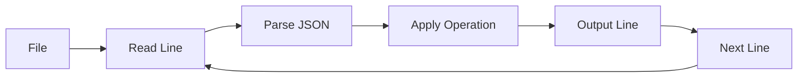

# Core Concepts

Understanding the fundamental concepts behind **jsonl-algebra** will help you use it more effectively and build powerful data pipelines. This page explains the "why" and "how" behind the tool.

## What is JSONL?

**JSONL** (JSON Lines) is a simple format where each line is a valid JSON object:

```json
{"id": 1, "name": "Alice"}
{"id": 2, "name": "Bob"}
{"id": 3, "name": "Charlie"}
```

### Why JSONL?

| Feature | JSONL | JSON Array |
|---------|-------|------------|
| **Streaming** | Can process line-by-line | Must load entire file |
| **Append-friendly** | Just add new lines | Must modify structure |
| **Error recovery** | One bad line won't break others | One error = broken file |
| **Memory usage** | Constant (per line) | Grows with file size |
| **Processing** | Start immediately | Wait for complete parse |

!!! tip "Best Use Cases for JSONL"
    - Log files (each log entry is a JSON object)
    - Event streams (continuous data)
    - Database exports (each row as JSON)
    - API responses (paginated results)
    - Large datasets (millions of records)

## Relational Algebra Basics

jsonl-algebra is built on **relational algebra** - the mathematical foundation of databases. Understanding these concepts helps you compose operations effectively.

### Relations as Tables

Think of a JSONL file as a **relation** (table):

```
users.jsonl → Users Relation

┌─────────┬────────┬─────┬──────┐
│ user_id │ name   │ age │ city │
├─────────┼────────┼─────┼──────┤
│ 1       │ Alice  │ 30  │ NYC  │
│ 2       │ Bob    │ 25  │ SF   │
│ 3       │ Charlie│ 35  │ NYC  │
└─────────┴────────┴─────┴──────┘
```

Each JSON object is a **row**, and each field is a **column**.

### Closure Property

The most important concept: **Every operation takes relations and produces relations**.


This means you can chain operations infinitely:

```bash
cat data.jsonl \
  | ja select ... \    # Relation → Relation
  | ja project ... \   # Relation → Relation
  | ja groupby ... \   # Relation → Relation
  | ja sort ...        # Relation → Relation
```

### Core Operations

#### Selection (σ) - Filter Rows

**Mathematical notation:** σ<sub>condition</sub>(R)

**Purpose:** Keep rows that meet a condition

```bash
ja select 'age > 30' users.jsonl
```

```
Input:                    Output:
┌────┬────────┬─────┐    ┌────┬────────┬─────┐
│ id │ name   │ age │    │ id │ name   │ age │
├────┼────────┼─────┤    ├────┼────────┼─────┤
│ 1  │ Alice  │ 30  │    │ 3  │Charlie │ 35  │
│ 2  │ Bob    │ 25  │    └────┴────────┴─────┘
│ 3  │Charlie │ 35  │
└────┴────────┴─────┘
```

#### Projection (π) - Choose Columns

**Mathematical notation:** π<sub>fields</sub>(R)

**Purpose:** Keep only specified fields

```bash
ja project name,age users.jsonl
```

```
Input:                      Output:
┌────┬────────┬─────┬───┐  ┌────────┬─────┐
│ id │ name   │ age │...│  │ name   │ age │
├────┼────────┼─────┼───┤  ├────────┼─────┤
│ 1  │ Alice  │ 30  │...│  │ Alice  │ 30  │
│ 2  │ Bob    │ 25  │...│  │ Bob    │ 25  │
└────┴────────┴─────┴───┘  └────────┴─────┘
```

#### Join (⋈) - Combine Relations

**Mathematical notation:** R ⋈<sub>condition</sub> S

**Purpose:** Combine rows from two relations where a condition matches

```bash
ja join users.jsonl orders.jsonl --on user_id=user_id
```

```
Users:                  Orders:
┌─────────┬──────┐     ┌──────────┬─────────┐
│ user_id │ name │     │ order_id │ user_id │
├─────────┼──────┤     ├──────────┼─────────┤
│ 1       │Alice │     │ 101      │ 1       │
│ 2       │ Bob  │     │ 102      │ 2       │
└─────────┴──────┘     └──────────┴─────────┘

Result:
┌─────────┬──────┬──────────┐
│ user_id │ name │ order_id │
├─────────┼──────┼──────────┤
│ 1       │Alice │ 101      │
│ 2       │ Bob  │ 102      │
└─────────┴──────┴──────────┘
```

#### Union (∪) - Combine All Rows

**Mathematical notation:** R ∪ S

**Purpose:** Merge two relations with the same schema

```bash
ja union file1.jsonl file2.jsonl
```

#### Distinct (δ) - Remove Duplicates

**Mathematical notation:** δ(R)

**Purpose:** Keep only unique rows

```bash
ja distinct users.jsonl
```

## Dot Notation for Nested Data

Real-world JSON is often nested. jsonl-algebra uses **dot notation** to access nested fields naturally.

### Simple Nesting

```json
{
  "user": {
    "name": "Alice",
    "age": 30
  }
}
```

Access with dots:

```bash
ja project user.name,user.age data.jsonl
```

### Deep Nesting

```json
{
  "user": {
    "profile": {
      "contact": {
        "email": "alice@example.com"
      }
    }
  }
}
```

Access deeply nested fields:

```bash
ja project user.profile.contact.email data.jsonl
```

### Arrays in Nested Data

```json
{
  "user": {
    "name": "Alice",
    "tags": ["admin", "premium"]
  }
}
```

Work with nested arrays:

```bash
# Access the tags field (returns the whole array)
ja project user.tags data.jsonl
```

!!! info "Learn More"
    See the [Dot Notation Guide](../concepts/dotnotation.md) for advanced patterns.

## Streaming Architecture

jsonl-algebra is designed for **streaming** - processing data without loading it all into memory.

### How Streaming Works



### Benefits

1. **Constant Memory Usage** - Process gigabyte files with megabytes of RAM
2. **Immediate Results** - See output as soon as first line is processed
3. **Composable** - Pipe operations together naturally
4. **Interruptible** - Can stop processing early (e.g., with `head`)

### Example: Processing Large Files

```bash
# This works even for 100GB files
cat huge_logs.jsonl \
  | ja select 'level == "ERROR"' \
  | ja project timestamp,message \
  | head -10
```

The pipeline:
- Reads one line at a time
- Filters immediately
- Projects fields
- Stops after 10 results

**Memory used:** ~constant (few MB), regardless of file size!

## Expression Language

jsonl-algebra uses a simple, safe expression language for filtering and calculations.

### Supported Operators

| Operator | Meaning | Example |
|----------|---------|---------|
| `==` | Equal | `status == "active"` |
| `!=` | Not equal | `role != "admin"` |
| `>` | Greater than | `age > 30` |
| `<` | Less than | `score < 100` |
| `>=` | Greater or equal | `price >= 50` |
| `<=` | Less or equal | `count <= 10` |
| `and` | Logical AND | `age > 18 and status == "active"` |
| `or` | Logical OR | `role == "admin" or role == "owner"` |

### Value Types

```bash
# Strings (use quotes)
ja select 'name == "Alice"'

# Numbers (no quotes)
ja select 'age > 30'

# Booleans
ja select 'is_active == true'

# Null checks
ja select 'email != null'
```

### Nested Field Access

```bash
ja select 'user.profile.age > 25 and user.status == "active"'
```

!!! tip "Safety First"
    The expression language is **safe** - it can't execute arbitrary code or access the filesystem.

## Pipeline Composition

The Unix philosophy: build complex solutions by composing simple tools.

### Pipeline Patterns

#### Pattern 1: Filter → Transform → Output

```bash
cat data.jsonl \
  | ja select 'active == true' \      # Filter
  | ja project id,name \               # Transform
  | ja sort name                       # Order
```

#### Pattern 2: Join → Aggregate → Report

```bash
ja join users.jsonl orders.jsonl --on id=user_id \
  | ja groupby user.name --agg total=sum:amount \
  | ja sort total --desc \
  | head -10
```

#### Pattern 3: Multi-stage Filtering

```bash
cat logs.jsonl \
  | ja select 'level == "ERROR"' \
  | ja select 'timestamp > "2025-01-01"' \
  | ja select 'component == "auth"'
```

### When to Use Pipelines vs Single Operations

**Use pipelines when:**
- Building complex transformations step-by-step
- Each step is conceptually distinct
- Debugging intermediate results

**Use combined conditions when:**
- Multiple filters on same data
- Performance is critical (fewer passes)
- Simpler to read

```bash
# Pipeline (3 passes over data)
ja select 'a > 10' | ja select 'b < 20' | ja select 'c == 30'

# Combined (1 pass)
ja select 'a > 10 and b < 20 and c == 30'
```

## Data Flow Model

Understanding how data flows helps you build efficient pipelines.

### Lazy Evaluation

Operations are **lazy** - they only process data as needed:

```bash
cat huge.jsonl | ja select 'x > 100' | head -1
```

This pipeline:
1. Opens file (doesn't read it all)
2. Processes lines one-by-one
3. Stops after finding first match
4. Never reads the entire file

### Buffering

Most operations are **streaming**, but some require buffering:

| Operation | Streaming | Why |
|-----------|-----------|-----|
| `select` | Yes | Can decide per-line |
| `project` | Yes | Can transform per-line |
| `sort` | No | Must see all data to order |
| `distinct` | No | Must track seen items |
| `groupby` | No | Must collect groups |
| `join` | Partial | Right file buffered, left streamed |

!!! warning "Memory Considerations"
    Non-streaming operations will load data into memory. For huge datasets, filter first!

## Type System

JSONL/JSON supports these types, all handled by jsonl-algebra:

```json
{
  "string": "text value",
  "number": 42,
  "float": 3.14,
  "boolean": true,
  "null": null,
  "array": [1, 2, 3],
  "object": {"nested": "value"}
}
```

### Type Handling in Operations

**Comparisons** are type-aware:
```bash
# Number comparison
ja select 'age > 30'      # Numeric

# String comparison
ja select 'name == "Alice"'  # Lexicographic
```

**Aggregations** respect types:
```bash
# Sum works on numbers
ja groupby category --agg total=sum:amount

# Count works on anything
ja groupby status --agg count
```

## Key Takeaways

1. **JSONL = Stream-friendly JSON** - One object per line
2. **Relations = Tables** - JSONL files are relations
3. **Operations preserve relations** - Enables composition
4. **Dot notation accesses nesting** - `user.profile.email`
5. **Streaming = Efficient** - Constant memory, immediate results
6. **Pipes compose tools** - Build complex solutions simply

## Next Steps

Now that you understand the concepts, dive deeper:

- [Relational Algebra Details](../concepts/relational-algebra.md) - Mathematical foundations
- [Dot Notation Guide](../concepts/dotnotation.md) - Master nested data
- [Streaming & Piping](../concepts/streaming.md) - Optimize for large data
- [CLI Commands](../cli/commands.md) - Learn all available operations
